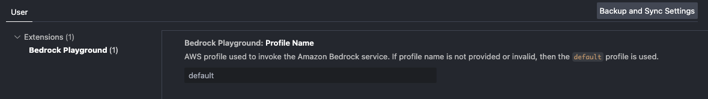
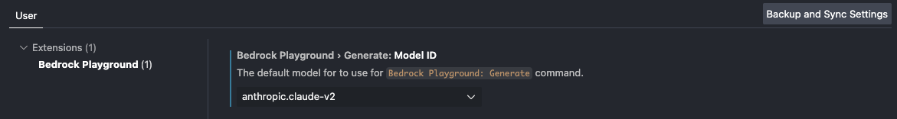

# Bedrock Visual Studio Code Playground

This is a Visual Studio Code (VS Code) extension which allows developers to easily explore and experiment with large language models (LLMs) available in Amazon Bedrock.

This is an open source project and we would love for you to be involved. To contribute, please refer to [CONTRIBUTING.md](./CONTRIBUTING.md).

## Getting Started

You can install this extension from the [VS Code Extension Marketplace](https://marketplace.visualstudio.com/items?itemName=AmazonWebServices-AISolutionsArchitecture.bedrock-vscode-playground)

This extension uses your local AWS credentials to invoke the Amazon Bedrock service. By default, the extension will use the `default` AWS profile. If you want to change the profile, you can update the `bedrockPlayground.profileName` setting in your User/Workspace settings.



The extension will also use the `us-west-2` region by default. To change the region, you can update the `bedrockPlayground.region` setting.


> ⚠️ By using this tool, you understand that it uses Amazon Bedrock's [InvokeModel](https://docs.aws.amazon.com/bedrock/latest/APIReference/API_runtime_InvokeModel.html) API, which will incur AWS charges. The charges you incur from using Amazon Bedrock will be your responsibility. Please review the latest Amazon Bedrock pricing [here](https://aws.amazon.com/bedrock/pricing/) before using this tool.

## Extension Features

The extension currently has 2 features:

### 1. LLM Playground

The playground environment provides a user interface for exploring and experimenting with LLMs in Amazon Bedrock. To open the playground environment, use the Command Palette and run the command `Bedrock Playground: Open Playground`.


You can adjust the inference parameters for each model by configuring your User/Workspace Settings.

### 2. Generate

You can use the `Bedrock Playground: Generate` command to use a LLM from Amazon Bedrock to generate text. You can configure which model to use by updating the setting `bedrockPlayground.generate.modelId`.



To generate text, just run the command `Bedrock Playground: Generate` using the Command Palette. The output will be placed in a new Markdown file.


You can also provide context from an active text editor when using the `Bedrock Playground: Generate` command. To provide context, simply select the code or text in your active text editor, run the command using the Command Palette, and input your request.


#### Customize prompt templates

The `Bedrock Playground: Generate` command uses prompt templates to customize the text it generates. To get the best results from your model, you may want to update the prompt templates. The default templates are designed for Anthropic's Claude model. If you are using a different model, tweak the templates in the `bedrockPlayground.generate.promptTemplates` based on the model provider's guidance on prompting.

To customize the template used when there is no context, you should update the `generate` template. This template string **must** contain a `{REQUEST}` placeholder which will be substituted with the user's request. For example:

```
"{REQUEST}\nPlease place your response in <response></response> XML tags."
```

To customize the prompt template that is used when context is provided, you should update the `generateWithContext` template. This template **must** contain both a `{REQUEST}` placeholder as well as a `{CONTEXT}` placeholder. For example:

```
"Use the context wrapped in <context></context> tags to respond to a user's request.\nThe user's request will be wrapped in <request></request> tags.\n<context>{CONTEXT}</context>\n<request>{REQUEST}</request>\nPlease place your response in <response></response> tags."
```

## Creators

[<br /><sub><a href="https://github.com/bobbywlindsey">bobbywlindsey</a></sub>](https://github.com/bobbywlindsey/)

[<br /><sub><a href="https://github.com/tonykchen">tonykchen</a></sub>](https://github.com/tonykchen/)
